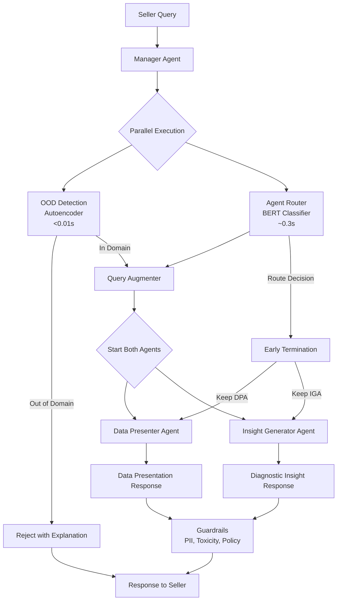
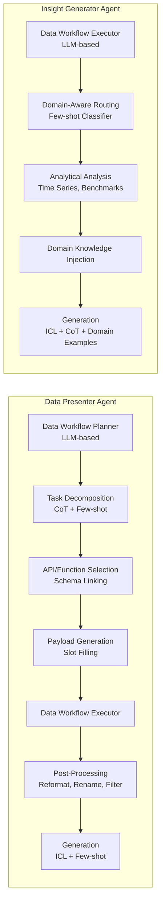

# Design Document: Insight Agents System

## Overview

The Insight Agents (IA) system implements a hierarchical manager-worker multi-agent architecture for e-commerce business intelligence, built on a plan-and-execute paradigm. The system achieves 89.5% question-level accuracy with sub-15-second P90 latency by combining specialized lightweight models for critical path operations with LLM-based planning and generation.

The architecture addresses three key design challenges:
1. **Coverage**: Supporting both descriptive analytics and diagnostic analysis across diverse seller queries
2. **Accuracy**: Achieving high precision through API-based retrieval and domain-aware reasoning
3. **Latency**: Optimizing response time through parallelization and specialized models

### Key Design Decisions

**Hierarchical Multi-Agent Structure**: Manager agent handles routing and safety, while specialized worker agents (Data Presenter and Insight Generator) provide tailored resolution paths for different query types.

**Specialized Lightweight Models**: Autoencoder-based OOD detection (<0.01s) and BERT-based routing (~0.3s) avoid unnecessary LLM calls on the critical path.

**API-Based RAG**: Leverages internal data APIs rather than text-to-SQL, trading flexibility for higher accuracy and robustness (no syntax errors, reduced hallucinations).

**Parallel Execution with Early Termination**: Both worker agents start concurrently, with the incorrect branch terminated early after routing completes, trading compute cost for latency reduction.

**Domain-Aware Knowledge Injection**: Insight Generator dynamically injects domain-specific knowledge, prompts, and few-shot examples based on query classification.

## Architecture

### High-Level System Flow



### Manager Agent Architecture

The Manager Agent orchestrates the entire system with three main components:

1. **OOD Detection** (Autoencoder-based)
   - Input: Query embedding from sentence transformer
   - Processing: Encode → Decode → Compute reconstruction error
   - Decision: Compare error to threshold (μ_id + λ * σ_id)
   - Output: In-domain / Out-of-domain classification
   - Latency: <0.01s per query

2. **Agent Router** (BERT-based classifier)
   - Input: Query text
   - Processing: Fine-tuned BERT (bge-small-en-v1.5, 33M params)
   - Decision: Data Presenter vs Insight Generator
   - Output: Routing decision
   - Latency: ~0.3s per query
   - Accuracy: >80%

3. **Query Augmenter** (LLM-based)
   - Input: Original query
   - Processing: Inject temporal context, clarify ambiguities
   - Output: Augmented query with explicit time ranges and context
   - Purpose: Reduce ambiguity for downstream LLM calls

### Worker Agent Architecture



## Components and Interfaces

### Manager Agent

**OOD Detection Component**

```python
class OODDetector:
    """Autoencoder-based out-of-domain detection."""
    
    def __init__(self, hidden_dim: int = 64, lambda_param: float = 4.0):
        """
        Initialize OOD detector.
        
        Args:
            hidden_dim: Dimension of autoencoder hidden layer
            lambda_param: Threshold multiplier for std deviation
        """
        self.encoder = Encoder(hidden_dim)
        self.decoder = Decoder(hidden_dim)
        self.lambda_param = lambda_param
        self.mu_id = None  # Mean reconstruction error on in-domain data
        self.sigma_id = None  # Std dev reconstruction error on in-domain data
    
    def train(self, in_domain_queries: List[str]):
        """
        Train autoencoder on in-domain queries.
        
        Minimizes reconstruction error: ||X - X_hat||
        Computes μ_id and σ_id for threshold calculation
        """
        embeddings = [self.embed_query(q) for q in in_domain_queries]
        
        # Train autoencoder
        for epoch in range(num_epochs):
            for X in embeddings:
                H = self.encoder(X)  # H = σ(W1*X + b1)
                X_hat = self.decoder(H)  # X_hat = σ(W2*H + b2)
                loss = reconstruction_error(X, X_hat)
                optimize(loss)
        
        # Compute threshold parameters
        errors = [reconstruction_error(X, self.forward(X)) for X in embeddings]
        self.mu_id = np.mean(errors)
        self.sigma_id = np.std(errors)
    
    def detect(self, query: str) -> OODResult:
        """
        Detect if query is out-of-domain.
        
        Returns:
            OODResult with is_out_of_domain flag and confidence
        """
        X = self.embed_query(query)
        X_hat = self.forward(X)
        error = reconstruction_error(X, X_hat)
        
        threshold = self.mu_id + self.lambda_param * self.sigma_id
        is_ood = error > threshold
        
        return OODResult(
            is_out_of_domain=is_ood,
            reconstruction_error=error,
            threshold=threshold,
            confidence=abs(error - threshold) / threshold
        )
    
    def embed_query(self, query: str) -> np.ndarray:
        """Embed query using sentence transformer."""
        return sentence_transformer.encode(query)
    
    def forward(self, X: np.ndarray) -> np.ndarray:
        """Forward pass through autoencoder."""
        H = self.encoder(X)
        X_hat = self.decoder(X)
        return X_hat

@dataclass
class OODResult:
    is_out_of_domain: bool
    reconstruction_error: float
    threshold: float
    confidence: float
    reason: Optional[str] = None
```

**Agent Router Component**

```python
class AgentRouter:
    """BERT-based classifier for routing queries to worker agents."""
    
    def __init__(self, model_name: str = "bge-small-en-v1.5"):
        """
        Initialize router with fine-tuned BERT model.
        
        Args:
            model_name: Base BERT model (33M parameters)
        """
        self.model = BERTClassifier.from_pretrained(model_name)
        self.tokenizer = BERTTokenizer.from_pretrained(model_name)
    
    def train(self, training_data: List[Tuple[str, AgentType]]):
        """
        Fine-tune BERT on super-sampled data.
        
        Args:
            training_data: List of (query, agent_type) pairs
                          300 data presenter + 300 insight generator samples
        """
        # Fine-tune BERT classifier
        for query, label in training_data:
            inputs = self.tokenizer(query, return_tensors="pt")
            outputs = self.model(**inputs)
            loss = cross_entropy(outputs.logits, label)
            optimize(loss)
    
    def route(self, query: str) -> RoutingDecision:
        """
        Route query to appropriate worker agent.
        
        Returns:
            RoutingDecision with agent type and confidence
        """
        inputs = self.tokenizer(query, return_tensors="pt")
        outputs = self.model(**inputs)
        probabilities = softmax(outputs.logits)
        
        agent_type = AgentType.DATA_PRESENTER if probabilities[0] > 0.5 else AgentType.INSIGHT_GENERATOR
        confidence = max(probabilities)
        
        return RoutingDecision(
            agent_type=agent_type,
            confidence=confidence,
            probabilities=probabilities
        )

@dataclass
class RoutingDecision:
    agent_type: AgentType
    confidence: float
    probabilities: np.ndarray

class AgentType(Enum):
    DATA_PRESENTER = "data_presenter"
    INSIGHT_GENERATOR = "insight_generator"
```

**Query Augmenter Component**

```python
class QueryAugmenter:
    """LLM-based query augmentation for ambiguity reduction."""
    
    def __init__(self, llm_client: LLMClient):
        self.llm = llm_client
    
    def augment(self, query: str, context: QueryContext) -> AugmentedQuery:
        """
        Augment query with temporal and contextual information.
        
        Focuses on clarifying time references:
        - "last week" → specific calendar week dates
        - "this month" → current month start/end dates
        - Inject today's date for relative references
        """
        prompt = f"""
        Clarify and expand the following query by adding explicit temporal context.
        
        Today's date: {context.today}
        Current week: {context.week_start} to {context.week_end}
        Current month: {context.month_start} to {context.month_end}
        
        Instructions:
        - "week" refers to calendar week (Monday-Sunday)
        - "month" refers to calendar month
        - Make all time references explicit with dates
        - Preserve original intent
        
        Original query: {query}
        
        Augmented query:
        """
        
        augmented_text = self.llm.generate(prompt)
        
        return AugmentedQuery(
            original=query,
            augmented=augmented_text,
            context=context
        )

@dataclass
class QueryContext:
    today: date
    week_start: date
    week_end: date
    month_start: date
    month_end: date

@dataclass
class AugmentedQuery:
    original: str
    augmented: str
    context: QueryContext
```

### Data Presenter Agent

**Data Workflow Planner**

```python
class DataWorkflowPlanner:
    """LLM-based planner for API-based data retrieval."""
    
    def __init__(self, llm_client: LLMClient, api_registry: APIRegistry):
        self.llm = llm_client
        self.api_registry = api_registry
    
    def plan(self, query: AugmentedQuery) -> DataWorkflowPlan:
        """
        Plan data retrieval workflow using divide-and-conquer.
        
        Steps:
        1. Task decomposition (CoT + few-shot)
        2. API/function selection (schema linking)
        3. Payload generation (slot filling)
        4. Secondary OOD detection
        """
        # Step 1: Task decomposition
        tasks = self.decompose_query(query)
        
        # Step 2: API selection with schema linking
        api_selections = []
        for task in tasks:
            api = self.select_api(task)
            api_selections.append((task, api))
        
        # Step 3: Payload generation
        api_calls = []
        for task, api in api_selections:
            payload = self.generate_payload(task, api)
            api_calls.append(APICall(api=api, payload=payload))
        
        # Step 4: Check if query exceeds data boundaries
        if self.is_out_of_scope(query, api_calls):
            return DataWorkflowPlan(out_of_scope=True, reason="Query exceeds available data")
        
        return DataWorkflowPlan(
            tasks=tasks,
            api_calls=api_calls,
            out_of_scope=False
        )
    
    def decompose_query(self, query: AugmentedQuery) -> List[DataTask]:
        """
        Decompose query into executable steps using CoT and few-shot learning.
        """
        prompt = f"""
        Decompose the following query into discrete data retrieval steps.
        Use chain-of-thought reasoning to ensure comprehensive coverage.
        
        Few-shot examples:
        {self.get_few_shot_examples()}
        
        Query: {query.augmented}
        
        Think step-by-step:
        1. What metrics are needed?
        2. What time periods are involved?
        3. What aggregations or comparisons are required?
        4. What is the dependency order?
        
        Decomposed tasks:
        """
        
        response = self.llm.generate(prompt)
        tasks = self.parse_tasks(response)
        return tasks
    
    def select_api(self, task: DataTask) -> APIDescriptor:
        """
        Select appropriate API using schema linking.
        
        Matches task requirements to:
        - API name and description
        - Column names and types
        - Available filters and aggregations
        """
        available_apis = self.api_registry.get_all()
        
        prompt = f"""
        Select the most appropriate API for the following task.
        
        Task: {task.description}
        Required metrics: {task.metrics}
        Time range: {task.time_range}
        
        Available APIs:
        {self.format_api_descriptions(available_apis)}
        
        Selected API (name only):
        """
        
        api_name = self.llm.generate(prompt).strip()
        return self.api_registry.get(api_name)
    
    def generate_payload(self, task: DataTask, api: APIDescriptor) -> Dict[str, Any]:
        """
        Generate API payload using slot filling.
        
        Populates required parameters from task requirements.
        """
        prompt = f"""
        Generate the API payload for the following task.
        
        Task: {task.description}
        API: {api.name}
        Required parameters: {api.parameters}
        
        Fill in the parameter values:
        """
        
        payload_str = self.llm.generate(prompt)
        payload = json.loads(payload_str)
        return payload
    
    def is_out_of_scope(self, query: AugmentedQuery, api_calls: List[APICall]) -> bool:
        """
        Secondary OOD detection comparing query to dataset metadata.
        
        Provides explicit "out" option to prevent hallucination.
        """
        prompt = f"""
        Determine if the query can be answered with the available data.
        
        Query: {query.augmented}
        Available APIs: {[call.api.name for call in api_calls]}
        Dataset metadata: {self.api_registry.get_metadata()}
        
        Can this query be answered? (yes/no/partial)
        If no or partial, explain what data is missing.
        
        Answer:
        """
        
        response = self.llm.generate(prompt)
        return "no" in response.lower()

@dataclass
class DataWorkflowPlan:
    tasks: List[DataTask]
    api_calls: List[APICall]
    out_of_scope: bool
    reason: Optional[str] = None

@dataclass
class DataTask:
    description: str
    metrics: List[str]
    time_range: TimeRange
    dependencies: List[str]

@dataclass
class APICall:
    api: APIDescriptor
    payload: Dict[str, Any]
```

**Data Workflow Executor**

```python
class DataWorkflowExecutor:
    """Executes data retrieval and post-processing operations."""
    
    def __init__(self, api_client: APIClient, calc_tools: CalculationTools):
        self.api_client = api_client
        self.calc_tools = calc_tools
    
    def execute(self, plan: DataWorkflowPlan) -> ExecutionResult:
        """
        Execute workflow plan with data retrieval and post-processing.
        """
        if plan.out_of_scope:
            return ExecutionResult(success=False, error=plan.reason)
        
        # Execute API calls
        raw_data = []
        for api_call in plan.api_calls:
            try:
                data = self.api_client.call(api_call.api.endpoint, api_call.payload)
                raw_data.append(data)
            except APIError as e:
                return ExecutionResult(success=False, error=str(e))
        
        # Perform aggregations using external calculation tools
        aggregated_data = self.aggregate_data(raw_data, plan.tasks)
        
        # Post-processing
        processed_data = self.post_process(aggregated_data)
        
        return ExecutionResult(
            success=True,
            data=processed_data,
            metadata=ExecutionMetadata(
                api_calls_count=len(plan.api_calls),
                execution_time=time.time() - start_time
            )
        )
    
    def aggregate_data(self, raw_data: List[Dict], tasks: List[DataTask]) -> Dict:
        """
        Aggregate data using external calculation tools to avoid LLM errors.
        """
        aggregated = {}
        for task in tasks:
            if task.aggregation_type == "sum":
                aggregated[task.metric] = self.calc_tools.sum(raw_data, task.metric)
            elif task.aggregation_type == "average":
                aggregated[task.metric] = self.calc_tools.average(raw_data, task.metric)
            # ... other aggregation types
        return aggregated
    
    def post_process(self, data: Dict) -> Dict:
        """
        Post-process data: reformat, rename columns, semantic filtering.
        """
        # Reformat data structures
        formatted = self.reformat_data(data)
        
        # Rename columns for clarity
        renamed = self.rename_columns(formatted)
        
        # Semantic matching-based column filtering
        filtered = self.filter_columns(renamed)
        
        return filtered

@dataclass
class ExecutionResult:
    success: bool
    data: Optional[Dict] = None
    error: Optional[str] = None
    metadata: Optional[ExecutionMetadata] = None
```

**Data Presenter Generation**

```python
class DataPresenterGenerator:
    """Generates natural language responses for data presentation."""
    
    def __init__(self, llm_client: LLMClient):
        self.llm = llm_client
    
    def generate(self, query: AugmentedQuery, data: Dict) -> str:
        """
        Generate response using ICL with few-shot examples.
        """
        prompt = f"""
        Present the following data in natural language to answer the seller's question.
        
        Few-shot examples:
        {self.get_few_shot_examples()}
        
        Question: {query.original}
        Data: {json.dumps(data, indent=2)}
        
        Response (natural language, clear and concise):
        """
        
        response = self.llm.generate(prompt)
        return response
    
    def get_few_shot_examples(self) -> str:
        """
        Retrieve few-shot examples demonstrating desired response format.
        """
        return """
        Example 1:
        Question: What were my sales last week?
        Data: {"total_sales": 15420.50, "week": "2024-01-15 to 2024-01-21"}
        Response: Your total sales for the week of January 15-21, 2024 were $15,420.50.
        
        Example 2:
        Question: How do my sales compare month over month?
        Data: {"current_month": 45230.00, "previous_month": 42100.00, "change_pct": 7.4}
        Response: Your sales increased by 7.4% from last month. You earned $45,230 this month compared to $42,100 last month, an increase of $3,130.
        """
```

### Insight Generator Agent

**Domain-Aware Routing**

```python
class DomainAwareRouter:
    """Few-shot learning based LLM classifier for domain routing."""
    
    def __init__(self, llm_client: LLMClient):
        self.llm = llm_client
        self.domain_paths = self.load_domain_paths()
    
    def route(self, query: AugmentedQuery) -> DomainPath:
        """
        Route query to domain-specific resolution path.
        
        Domains: performance, benchmarking, recommendation, trend analysis, etc.
        """
        prompt = f"""
        Classify the following diagnostic query into domain categories.
        
        Few-shot examples:
        {self.get_few_shot_examples()}
        
        Query: {query.augmented}
        
        Domain categories (select all that apply):
        - performance: Overall business performance assessment
        - benchmarking: Comparison to benchmarks or competitors
        - recommendation: Actionable recommendations
        - trend: Time series trend analysis
        - seasonal: Seasonal pattern analysis
        
        Selected domains:
        """
        
        response = self.llm.generate(prompt)
        domains = self.parse_domains(response)
        
        return self.domain_paths.get_path(domains)
    
    def load_domain_paths(self) -> DomainPathRegistry:
        """
        Load predefined domain-aware resolution paths.
        
        Each path includes:
        - Analytical analysis methods
        - Domain-aware knowledge
        - Prompt templates
        - Few-shot examples from domain experts
        """
        return DomainPathRegistry.load_from_config()

@dataclass
class DomainPath:
    domains: List[str]
    analytical_methods: List[AnalyticalMethod]
    domain_knowledge: str
    prompt_template: str
    few_shot_examples: List[str]

class AnalyticalMethod(Enum):
    TIME_SERIES_ANALYSIS = "time_series"
    SEASONAL_ANALYSIS = "seasonal"
    TREND_ANALYSIS = "trend"
    BENCHMARK_ANALYSIS = "benchmark"
    CORRELATION_ANALYSIS = "correlation"
```

**Insight Generator Execution**

```python
class InsightGeneratorExecutor:
    """Executes domain-aware insight generation."""
    
    def __init__(self, llm_client: LLMClient, api_client: APIClient, analytics: AnalyticsEngine):
        self.llm = llm_client
        self.api_client = api_client
        self.analytics = analytics
    
    def execute(self, query: AugmentedQuery, domain_path: DomainPath) -> InsightResult:
        """
        Execute insight generation with domain-aware analysis.
        """
        # Retrieve multi-dimensional data
        data = self.retrieve_multi_dimensional_data(query, domain_path)
        
        # Apply analytical methods
        analysis_results = {}
        for method in domain_path.analytical_methods:
            if method == AnalyticalMethod.TIME_SERIES_ANALYSIS:
                analysis_results['time_series'] = self.analytics.time_series_analysis(data)
            elif method == AnalyticalMethod.SEASONAL_ANALYSIS:
                analysis_results['seasonal'] = self.analytics.seasonal_analysis(data)
            elif method == AnalyticalMethod.TREND_ANALYSIS:
                analysis_results['trend'] = self.analytics.trend_analysis(data)
            elif method == AnalyticalMethod.BENCHMARK_ANALYSIS:
                analysis_results['benchmark'] = self.analytics.benchmark_analysis(data)
        
        # Generate insights with domain knowledge injection
        insights = self.generate_insights(query, data, analysis_results, domain_path)
        
        return InsightResult(
            insights=insights,
            analysis=analysis_results,
            domain=domain_path.domains
        )
    
    def retrieve_multi_dimensional_data(self, query: AugmentedQuery, domain_path: DomainPath) -> Dict:
        """
        Retrieve data across multiple business dimensions.
        """
        dimensions = self.identify_dimensions(query, domain_path)
        data = {}
        
        for dimension in dimensions:
            apis = self.get_apis_for_dimension(dimension)
            dimension_data = []
            for api in apis:
                result = self.api_client.call(api.endpoint, self.build_payload(query, api))
                dimension_data.append(result)
            data[dimension] = dimension_data
        
        return data
    
    def generate_insights(self, query: AugmentedQuery, data: Dict, analysis: Dict, domain_path: DomainPath) -> str:
        """
        Generate insights using ICL with CoT and domain-specific few-shot examples.
        """
        prompt = domain_path.prompt_template.format(
            query=query.original,
            data=json.dumps(data, indent=2),
            analysis=json.dumps(analysis, indent=2),
            domain_knowledge=domain_path.domain_knowledge,
            few_shot_examples="\n\n".join(domain_path.few_shot_examples)
        )
        
        prompt += """
        
        Instructions:
        1. Identify all factors that contributed to the observed outcome
        2. Explain causal relationships, not just correlations
        3. Provide specific, quantified recommendations
        4. Show your reasoning step-by-step (chain-of-thought)
        
        Think through this step-by-step:
        """
        
        insights = self.llm.generate(prompt)
        return insights

@dataclass
class InsightResult:
    insights: str
    analysis: Dict
    domain: List[str]
```

## Data Models

### Core Data Types

```python
from dataclasses import dataclass
from typing import List, Dict, Optional, Any
from enum import Enum
from datetime import date, datetime

@dataclass
class UserQuery:
    text: str
    session_id: str
    timestamp: datetime

@dataclass
class SystemResponse:
    success: bool
    content: str
    metadata: ResponseMetadata
    error: Optional[str] = None

@dataclass
class ResponseMetadata:
    agent_type: AgentType
    execution_time_ms: float
    api_calls_count: int
    latency_breakdown: Dict[str, float]
    accuracy_metrics: Optional[AccuracyMetrics] = None

@dataclass
class AccuracyMetrics:
    relevance: float  # Ratio of key words addressed
    correctness: float  # Ratio of correct insights
    completeness: float  # Ratio of required insights provided
    
    def is_accurate(self, threshold: float = 0.8) -> bool:
        """Question-level accuracy: all metrics > threshold."""
        return (self.relevance > threshold and 
                self.correctness > threshold and 
                self.completeness > threshold)

@dataclass
class APIDescriptor:
    name: str
    endpoint: str
    description: str
    parameters: List[ParameterSchema]
    columns: List[ColumnSchema]
    dimension: BusinessDimension

@dataclass
class ParameterSchema:
    name: str
    type: str
    required: bool
    description: str

@dataclass
class ColumnSchema:
    name: str
    type: str
    description: str

class BusinessDimension(Enum):
    SALES = "sales"
    PRICING = "pricing"
    INVENTORY = "inventory"
    REVIEWS = "reviews"
    TRAFFIC = "traffic"
    ACCOUNT = "account"

@dataclass
class TimeRange:
    start: date
    end: date
    granularity: TimeGranularity

class TimeGranularity(Enum):
    HOUR = "hour"
    DAY = "day"
    WEEK = "week"
    MONTH = "month"
    QUARTER = "quarter"
    YEAR = "year"
```

## Correctness Properties


*A property is a characteristic or behavior that should hold true across all valid executions of a system—essentially, a formal statement about what the system should do. Properties serve as the bridge between human-readable specifications and machine-verifiable correctness guarantees.*

### Property 1: OOD Reconstruction Error Computation

*For any* user query, the OOD_Detection should compute the reconstruction error by encoding the query with a sentence transformer, passing it through the trained autoencoder, and calculating ||X - X_hat||.

**Validates: Requirements 1.1**

### Property 2: OOD Threshold Classification

*For any* query with computed reconstruction error, if the error exceeds (μ_id + λ * σ_id), the OOD_Detection should classify it as out-of-domain; otherwise, it should classify it as in-domain.

**Validates: Requirements 1.3**

### Property 3: OOD Query Rejection

*For any* query classified as out-of-domain, the Manager_Agent should reject it with a clear explanation and should not route it to any Worker_Agent.

**Validates: Requirements 1.4, 1.5**

### Property 4: OOD Detection Latency

*For any* query, the OOD_Detection should complete evaluation in less than 0.01 seconds.

**Validates: Requirements 1.6**

### Property 5: OOD Precision Bias

*For any* labeled test dataset, the OOD_Detection should achieve higher precision than recall, favoring false negatives over false positives.

**Validates: Requirements 1.7**

### Property 6: Parallel Manager Execution

*For any* query, the OOD_Detection and Agent_Router should execute in parallel, and both should complete before the Manager_Agent proceeds with routing.

**Validates: Requirements 1.8, 2.7, 2.8**

### Property 7: BERT Routing Classification

*For any* in-domain query, the Agent_Router should classify it as either DATA_PRESENTER or INSIGHT_GENERATOR using the fine-tuned BERT model.

**Validates: Requirements 2.1**

### Property 8: Descriptive Query Routing

*For any* query requesting descriptive analytics or data presentation, the Agent_Router should route to the Data_Presenter_Agent.

**Validates: Requirements 2.3**

### Property 9: Diagnostic Query Routing

*For any* query requesting diagnostic analysis, summarization, or benchmarking, the Agent_Router should route to the Insight_Generator_Agent.

**Validates: Requirements 2.4**

### Property 10: Agent Router Latency

*For any* query, the Agent_Router should complete classification in approximately 0.3 seconds (±0.1s).

**Validates: Requirements 2.5**

### Property 11: Agent Router Accuracy

*For any* labeled test dataset, the Agent_Router should achieve at least 80% classification accuracy.

**Validates: Requirements 2.6**

### Property 12: Query Augmentation with Temporal Context

*For any* query containing time references (relative or absolute), the Query_Augmenter should inject contextual information including today's date, current week boundaries, and calendar month boundaries.

**Validates: Requirements 3.1, 3.3**

### Property 13: Query Augmentation Preserves Intent

*For any* query, after augmentation the enhanced query should maintain the same semantic intent as the original query while adding clarifying details.

**Validates: Requirements 3.2, 3.5**

### Property 14: Augmented Query Usage

*For any* query, the Manager_Agent should pass the augmented query (not the original) to the selected Worker_Agent.

**Validates: Requirements 3.4, 3.6**

### Property 15: Task Decomposition with CoT

*For any* query routed to the Data_Presenter_Agent, the Data_Workflow_Planner should decompose it into executable steps using chain-of-thought reasoning and few-shot learning.

**Validates: Requirements 4.1, 4.2, 4.3**

### Property 16: API Selection with Schema Linking

*For any* set of decomposed tasks, the Data_Workflow_Planner should select appropriate APIs by performing schema linking to match query entities to API names, descriptions, and column metadata.

**Validates: Requirements 4.4, 4.5**

### Property 17: Payload Generation with Slot Filling

*For any* selected API, the Data_Workflow_Planner should generate a payload with all required parameters filled using slot filling from the query and task context.

**Validates: Requirements 4.6**

### Property 18: Secondary OOD Detection

*For any* planned workflow, the Data_Workflow_Planner should perform secondary out-of-scope detection by comparing the query against dataset metadata, and should provide an explicit "out" option when data boundaries are exceeded.

**Validates: Requirements 4.7, 4.8**

### Property 19: Tool Metadata and Few-Shot Usage

*For any* planning operation, the Data_Workflow_Planner should access and leverage tool metadata and few-shot examples from memory.

**Validates: Requirements 4.9, 12.1, 12.2**

### Property 20: API Execution with Correct Payloads

*For any* workflow plan, the Data_Workflow_Executor should call selected APIs with the generated payloads matching the API parameter schemas.

**Validates: Requirements 5.1**

### Property 21: External Calculation Tools Usage

*For any* data aggregation or transformation operation, the Data_Workflow_Executor should use external calculation tools rather than LLM-based calculations.

**Validates: Requirements 5.2, 10.3**

### Property 22: Data Post-Processing

*For any* retrieved data, the Data_Workflow_Executor should apply post-processing including reformatting, column renaming, and semantic matching-based filtering before generation.

**Validates: Requirements 5.3**

### Property 23: API Error Handling

*For any* API call that fails, the Data_Workflow_Executor should handle the error gracefully and return a meaningful error message rather than throwing an unhandled exception.

**Validates: Requirements 5.4**

### Property 24: Data Presenter ICL Generation

*For any* completed data workflow, the Data_Presenter_Agent should generate natural language responses using in-context learning with few-shot examples.

**Validates: Requirements 5.5**

### Property 25: Domain-Specific Decomposition

*For any* query routed to the Insight_Generator_Agent, the Data_Workflow_Executor should decompose it into domain-specific categories (performance, benchmarking, recommendation, trend, seasonal).

**Validates: Requirements 6.1**

### Property 26: Few-Shot Domain Routing

*For any* insight query, the Insight_Generator_Agent should use a few-shot learning based LLM classifier to route to domain-specific resolution paths.

**Validates: Requirements 6.2, 6.3**

### Property 27: Domain Path Completeness

*For any* selected domain-aware resolution path, it should include analytical analysis methods, domain-aware knowledge, prompt templates, and few-shot examples from domain experts.

**Validates: Requirements 6.4, 6.5**

### Property 28: Dynamic Domain Knowledge Injection

*For any* insight generation operation, the Insight_Generator_Agent should dynamically inject domain knowledge based on the query's domain classification.

**Validates: Requirements 6.6**

### Property 29: Insight Generation with CoT and Domain Examples

*For any* insight generation, the Insight_Generator_Agent should use in-context learning with chain-of-thought reasoning and domain-specific few-shot examples.

**Validates: Requirements 6.7**

### Property 30: Parallel Worker Execution with Early Termination

*For any* query, the System should initiate both Data_Presenter_Agent and Insight_Generator_Agent concurrently, and should terminate the incorrect branch early once the Agent_Router determines the correct path.

**Validates: Requirements 7.1, 7.2, 7.3**

### Property 31: End-to-End Latency

*For any* set of queries, the P90 latency (90th percentile) for end-to-end query processing should be less than 15 seconds.

**Validates: Requirements 7.5**

### Property 32: Guardrails Application

*For any* worker agent response, the Manager_Agent should apply guardrails to evaluate for PII leakage, toxic messages, and policy violations before returning to the user.

**Validates: Requirements 8.1, 8.2**

### Property 33: Guardrails Enforcement

*For any* response containing PII, toxic content, or policy violations, the Manager_Agent should modify or reject the response rather than returning it to the user.

**Validates: Requirements 8.3, 8.4**

### Property 34: Multi-Dimensional Data Retrieval

*For any* diagnostic query, the Insight_Generator_Agent should retrieve data across multiple relevant business dimensions before performing analysis.

**Validates: Requirements 9.1**

### Property 35: Analytical Techniques Application

*For any* insight generation, the Insight_Generator_Agent should apply relevant analytical techniques including time series analysis, seasonal analysis, trend analysis, and benchmark analysis based on the domain path.

**Validates: Requirements 9.2**

### Property 36: Causal Analysis Output

*For any* completed analysis, the Insight_Generator_Agent should identify correlations, causal factors, and patterns in the data.

**Validates: Requirements 9.3**

### Property 37: Insight Response Completeness

*For any* insight response, it should contain both explanatory insights (why something happened) and actionable recommendations (what to do next).

**Validates: Requirements 9.4**

### Property 38: Domain Expert Knowledge Usage

*For any* insight generation, the Insight_Generator_Agent should incorporate domain expert knowledge from the selected domain path.

**Validates: Requirements 9.5**

### Property 39: API-Based Retrieval Over Text-to-SQL

*For any* data retrieval operation, the Data_Workflow_Planner should use API-based retrieval rather than generating SQL queries.

**Validates: Requirements 10.1, 10.2**

### Property 40: Question-Level Accuracy

*For any* benchmark dataset, the System should achieve at least 89.5% question-level accuracy, where a question is accurate if its relevance, correctness, and completeness scores all exceed 0.8.

**Validates: Requirements 10.4, 11.4**

### Property 41: Response Quality Metrics Computation

*For any* response, the System should compute relevance (key words addressed / total key words), correctness (correct insights / total insights), and completeness (required insights provided / total required insights) scores.

**Validates: Requirements 11.1, 11.2, 11.3**

### Property 42: Accuracy Metric Tracking

*For any* query-response cycle, the System should track question-level accuracy as the primary performance metric.

**Validates: Requirements 11.5**

### Property 43: LLM-Based Tool Selection

*For any* tool selection operation, the Data_Workflow_Planner should match query requirements to tool capabilities using LLM-based selection with detailed API/function descriptions.

**Validates: Requirements 12.3, 12.4**

### Property 44: Dual Tool Support

*For any* workflow plan, the System should support both data retrieval APIs and calculation/transformation functions.

**Validates: Requirements 12.5**

## Error Handling

### Error Categories

The system handles four categories of errors:

1. **Out-of-Domain Errors**: Queries outside system capabilities
2. **Data Errors**: API failures, missing data, data quality issues
3. **Calculation Errors**: Errors in aggregation or transformation
4. **Policy Errors**: Guardrail violations (PII, toxicity, policy)

### Error Handling Strategy

**Out-of-Domain Errors:**
- Detected at two levels: Manager Agent (autoencoder) and Data Workflow Planner (metadata comparison)
- Return clear explanation of system capabilities
- Suggest alternative queries or clarifications
- Do not expose internal system details

**Data Errors:**
- Implement retry logic for transient API failures (exponential backoff)
- Return partial results when possible
- Provide meaningful error messages to users
- Log errors for monitoring

**Calculation Errors:**
- Use external calculation tools to avoid LLM errors
- Validate calculation results for reasonableness
- Fall back to simpler calculations if complex ones fail

**Policy Errors:**
- Detect during guardrails phase
- Modify responses to remove violations when possible
- Reject responses that cannot be safely modified
- Log violations for review

### Error Response Format

```python
@dataclass
class ErrorResponse:
    success: bool = False
    error_code: ErrorCode
    message: str
    suggestions: Optional[List[str]] = None
    retryable: bool = False

class ErrorCode(Enum):
    OUT_OF_DOMAIN = "out_of_domain"
    DATA_UNAVAILABLE = "data_unavailable"
    API_FAILURE = "api_failure"
    CALCULATION_ERROR = "calculation_error"
    POLICY_VIOLATION = "policy_violation"
    TIMEOUT = "timeout"
```

### Timeout Handling

- Manager Agent: 2 second timeout for OOD + routing
- Worker Agents: 12 second timeout for execution
- Individual API calls: 3 second timeout
- Total end-to-end: 15 second P90 target

### Retry Logic

- Transient API failures: Retry up to 3 times with exponential backoff (0.5s, 1s, 2s)
- Rate limit errors: Wait for rate limit reset
- Authentication errors: Do not retry, return error immediately
- Timeout errors: Return partial results if available

## Testing Strategy

### Dual Testing Approach

The system requires both unit testing and property-based testing for comprehensive coverage:

**Unit Tests** focus on:
- Specific examples of routing decisions (descriptive vs diagnostic queries)
- Edge cases (empty queries, malformed time references, boundary conditions)
- Error conditions (API failures, OOD queries, calculation errors)
- Integration points (Manager ↔ Workers, Workers ↔ APIs)
- Model performance (OOD precision/recall, routing accuracy)

**Property-Based Tests** focus on:
- Universal properties that hold for all inputs (see Correctness Properties section)
- Comprehensive input coverage through randomization
- Invariants maintained across all executions (latency bounds, accuracy thresholds)

Both testing approaches are complementary and necessary. Unit tests catch concrete bugs in specific scenarios, while property tests verify general correctness across the input space.

### Property-Based Testing Configuration

**Testing Library**: Use `hypothesis` for Python implementation

**Test Configuration**:
- Minimum 100 iterations per property test (due to randomization)
- Each property test must reference its design document property
- Tag format: `# Feature: insight-agents-system, Property {number}: {property_text}`

**Example Property Test Structure**:

```python
from hypothesis import given, strategies as st
import pytest

# Feature: insight-agents-system, Property 2: OOD Threshold Classification
@given(st.text(min_size=1, max_size=500))
def test_ood_threshold_classification(query_text):
    """Test that OOD classification follows threshold rule."""
    query = UserQuery(text=query_text, session_id="test", timestamp=datetime.now())
    
    # Compute reconstruction error
    result = ood_detector.detect(query)
    
    # Verify classification follows threshold rule
    threshold = ood_detector.mu_id + ood_detector.lambda_param * ood_detector.sigma_id
    
    if result.reconstruction_error > threshold:
        assert result.is_out_of_domain == True
    else:
        assert result.is_out_of_domain == False

# Feature: insight-agents-system, Property 40: Question-Level Accuracy
def test_question_level_accuracy_on_benchmark():
    """Test that system achieves 89.5% accuracy on benchmark dataset."""
    benchmark_queries = load_benchmark_dataset()  # 100 queries with ground truth
    
    accurate_count = 0
    for query, ground_truth in benchmark_queries:
        response = system.process_query(query)
        metrics = evaluate_response(response, ground_truth)
        
        # Question is accurate if all metrics > 0.8
        if (metrics.relevance > 0.8 and 
            metrics.correctness > 0.8 and 
            metrics.completeness > 0.8):
            accurate_count += 1
    
    accuracy = accurate_count / len(benchmark_queries)
    assert accuracy >= 0.895, f"Accuracy {accuracy} below 89.5% threshold"
```

### Test Data Generators

Property tests require generators for:
- User queries (in-domain and out-of-domain)
- Time references (relative and absolute)
- Business dimensions and metrics
- API responses (success and failure cases)
- Multi-dimensional data sets

### Model Testing

Specialized tests for ML components:
- OOD Detector: Precision/recall on labeled dataset, latency benchmarks
- Agent Router: Classification accuracy, confusion matrix, latency benchmarks
- Domain Router: Classification accuracy for domain categories

### Integration Testing

Integration tests verify:
- End-to-end query processing (user query → system response)
- Manager Agent coordination with Worker Agents
- Worker Agent interaction with APIs
- Guardrails application to various response types
- Parallel execution and early termination

### Performance Testing

Performance tests verify:
- OOD detection latency < 0.01s
- Agent routing latency ~0.3s
- End-to-end P90 latency < 15s
- Throughput under concurrent load
- Memory usage during long sessions

### Accuracy Testing

Accuracy tests verify:
- Question-level accuracy ≥ 89.5% on benchmark dataset
- Relevance, correctness, completeness scores
- Comparison to baseline (monolithic LLM approach)

### Test Coverage Goals

- Unit test coverage: >80% of code paths
- Property test coverage: 100% of correctness properties (44 properties)
- Integration test coverage: All major user workflows
- Model test coverage: All ML components (OOD, routing, domain classification)
- Error path coverage: All error categories and codes
